# 🛡️ FraudLens AI

## AI-Powered Transaction Risk Analysis & Fraud Safety Assistant

FraudLens AI is a full-stack AI application that combines **Machine Learning, Retrieval-Augmented Generation (RAG), Vector Search, and Generative AI** to help users make safer financial decisions.

The platform analyzes transaction details using a **CatBoost machine learning model** to estimate fraud probability and classify transaction risk before proceeding.

It also includes **FraudLens Assistant**, a RAG-powered financial safety assistant that provides practical guidance about scams, UPI safety, phishing, OTP security, card safety, and actions to take after suspected fraud.

> **Fraud prediction and fraud-safety guidance are intentionally separated:**  
> The CatBoost model handles transaction risk prediction, while the RAG assistant handles safety education and guidance.

---

# ✨ Key Highlights

- 🤖 AI-powered transaction fraud risk prediction
- 📊 Fraud probability and risk-level classification
- 🔍 Transaction analysis before proceeding with a payment
- 🧠 CatBoost machine learning model
- 💬 RAG-powered FraudLens Safety Assistant
- 🔎 Semantic search using vector embeddings
- 🗄️ MongoDB Atlas Vector Search
- 🧩 Context-grounded AI responses
- 📈 Live transaction monitoring
- 📊 Transaction history and risk distribution
- 🧠 Model insights and technology explanation
- ⚡ React + Node.js + Flask microservice architecture
- 📱 Responsive modern fintech-inspired interface
- 🔐 Environment-based secret management
- 🛡️ Safety-focused AI responses without requesting sensitive credentials

---

# 🎯 Problem Statement

Digital payment fraud and online scams are becoming increasingly sophisticated.

Users often need to make quick financial decisions without knowing whether a transaction exhibits suspicious characteristics or what precautions they should take.

FraudLens AI addresses this problem through two complementary AI components:

### 1. Transaction Risk Prediction

A **CatBoost classifier** analyzes transaction attributes and estimates the probability that a transaction may be fraudulent.

### 2. Fraud Safety Assistant

A **RAG-based AI assistant** retrieves relevant fraud-safety knowledge and uses an LLM to provide practical, context-grounded guidance.


🚀 Features :
🔍 Transaction Risk Analysis

Users can enter transaction information and analyze it before proceeding.

The system:

1. Accepts transaction details from the user.
2. Sends the information to the Node.js backend.
3. Forwards the transaction to the Flask ML service.
4. CatBoost analyzes the transaction.
5. The model generates a fraud probability.
6. Fraud probability is compared against the configured threshold.
7. The transaction is categorized into a risk level.
8. The result is displayed through the React interface.
9. The transaction can be stored in MongoDB for monitoring.

```
This creates a single platform for:

Transaction Analysis
      +
Fraud Safety Guidance
      =
FraudLens AI
```


## 📸 Screenshots

### 🏠 Home Page

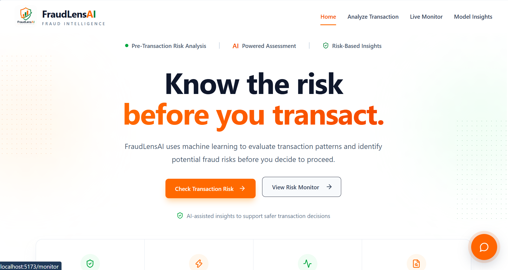

### 🔍 Analyze Transaction

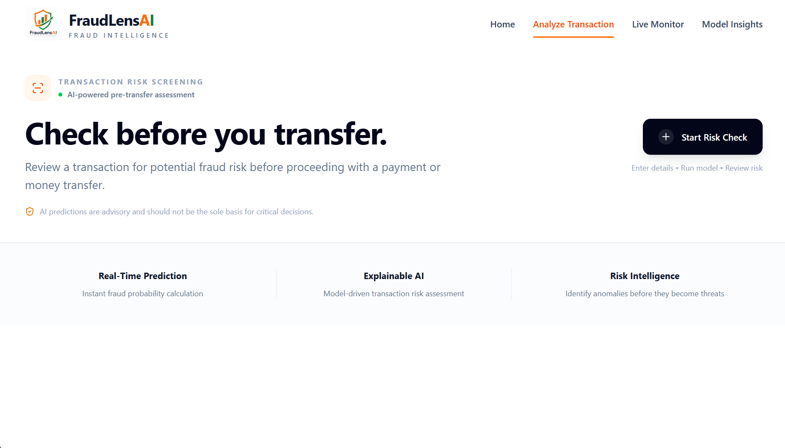

### Processing

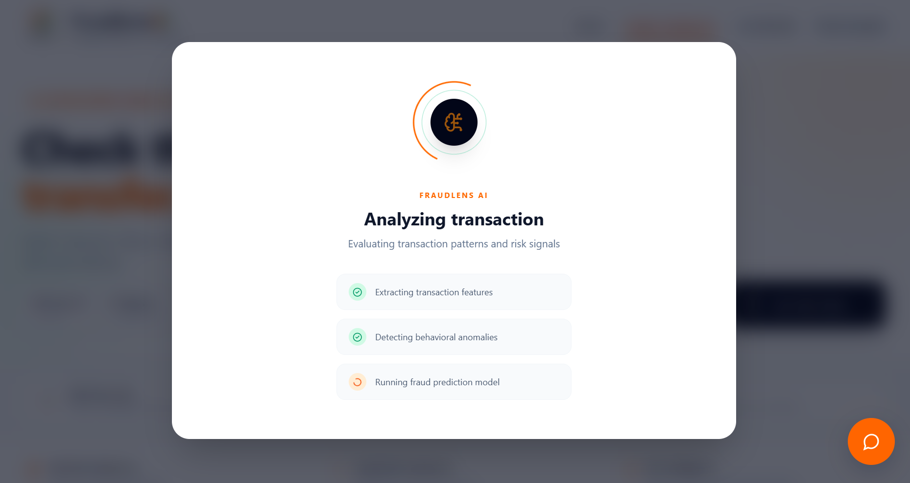

### Output

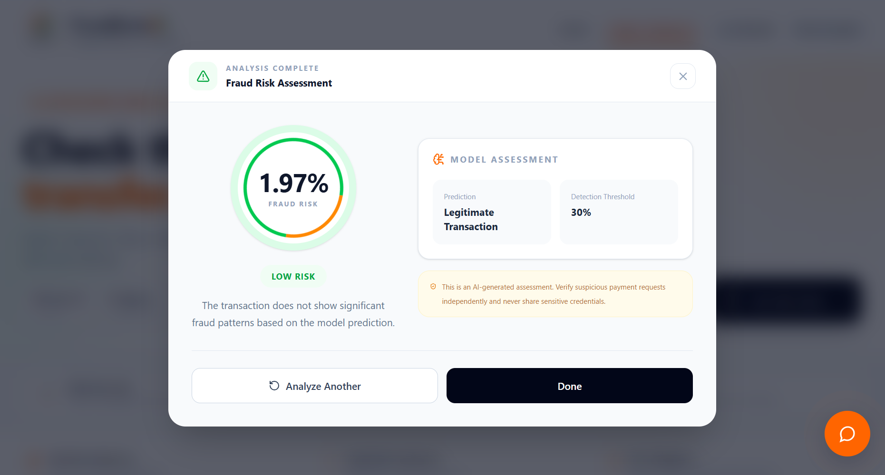

### ✏️ Form

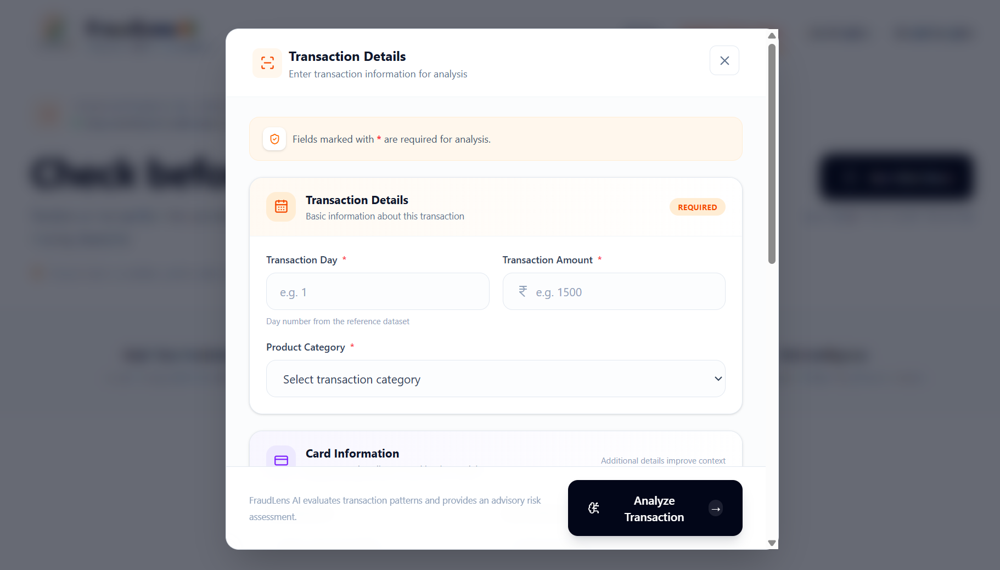

### 📊 Live Monitor

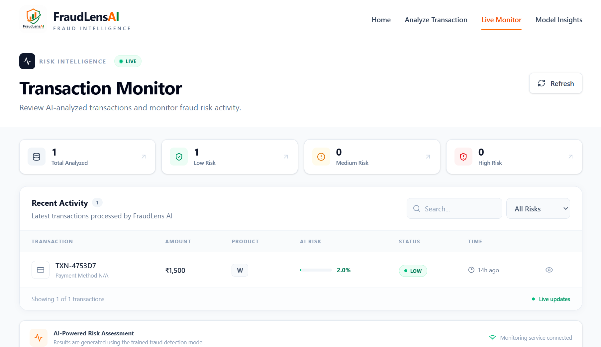

### 🧠 Model Insights

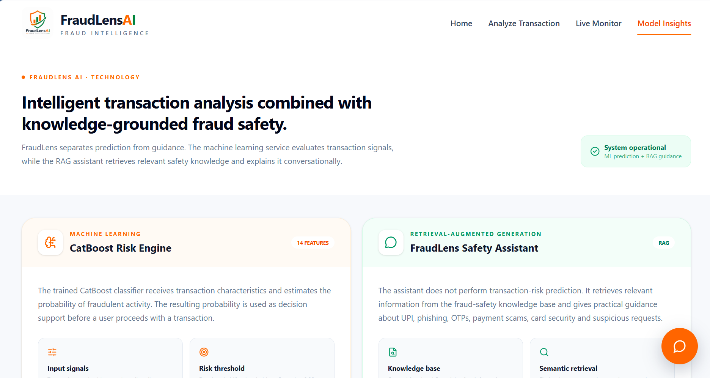

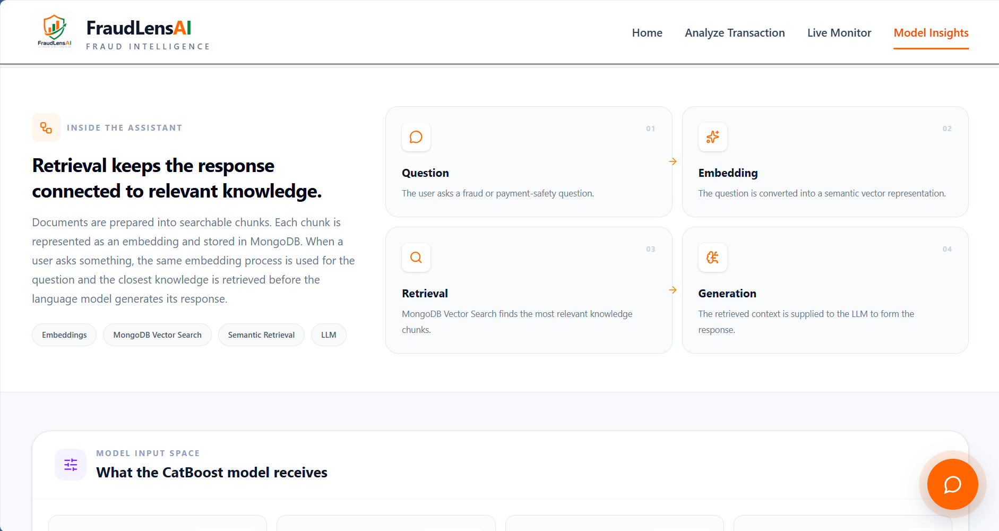

### 🤖 FraudLens Assistant

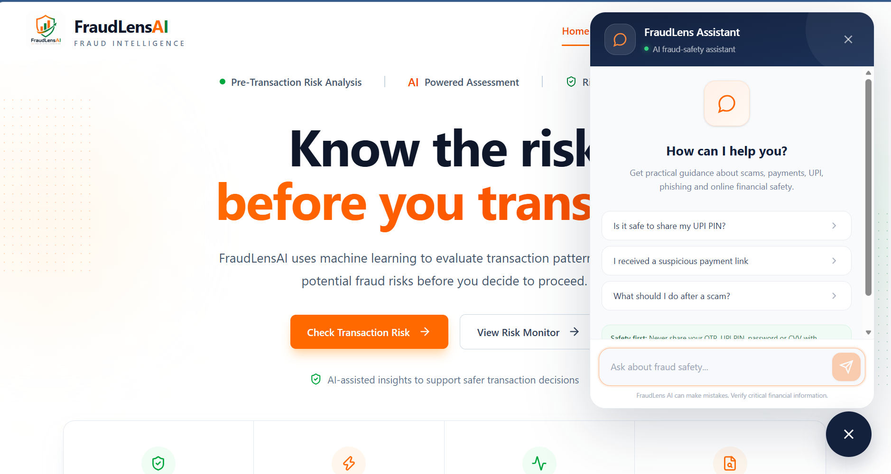
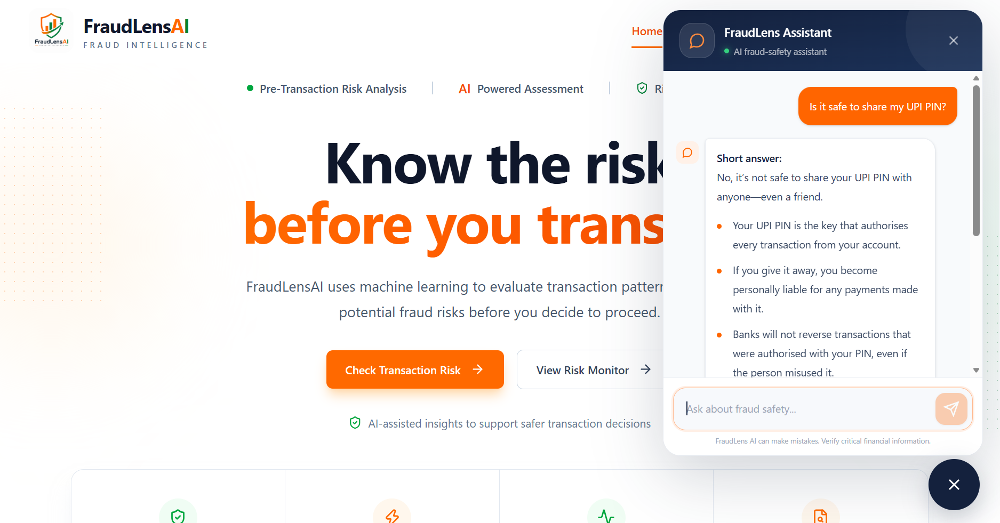

### Responsive

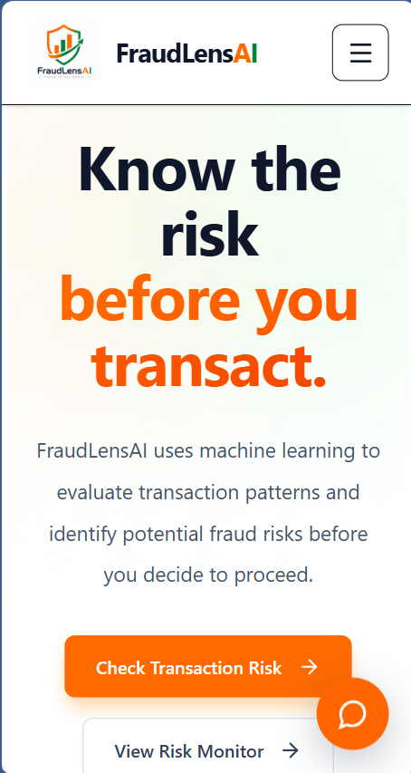

---

## 🏗️ Complete System Architecture

```text

                      ┌──────────────────────┐
                       │     React Frontend   │
                       │   Vite + Tailwind CSS │
                       └───────────┬──────────┘
                                   │
                                   │ HTTP
                                   ▼
                       ┌──────────────────────┐
                       │    Node.js Backend   │
                       │       Express.js     │
                       └───────┬────────┬─────┘
                               │        │
                 Transaction   │        │   Chat
                               │        │
                               ▼        ▼
                  ┌──────────────┐   ┌────────────────┐
                  │  Flask ML    │   │   Flask RAG    │
                  │   Service    │   │    Service     │
                  └──────┬───────┘   └───────┬────────┘
                         │                    │
                         ▼                    ▼
                  ┌──────────────┐     ┌───────────────┐
                  │   CatBoost   │     │   Embedding   │
                  │    Model     │     │     Model     │
                  └──────┬───────┘     └───────┬───────┘
                         │                     │
                         ▼                     ▼
                  Fraud Probability     MongoDB Vector
                  + Risk Level             Search
                                               │
                                               ▼
                                            Context
                                               │
                                               ▼
                                             LLM
                                               │
                                               ▼
                                         AI Response


                  ┌────────────────────────────┐
                  │         MongoDB             │
                  │                            │
                  │  • Transaction History     │
                  │  • Knowledge Chunks        │
                  │  • Vector Embeddings       │
                  └────────────────────────────┘

```

🔄 Application Workflow:

### Transaction Risk Analysis

1. The user enters transaction details in the React frontend.
2. The React frontend sends the transaction data to the Node.js/Express backend.
3. The backend forwards the transaction data to the Flask ML service.
4. The CatBoost model analyzes the transaction features.
5. The ML service returns the fraud probability and prediction.
6. FraudLens categorizes the transaction as **Low, Medium, or High risk** based on the configured threshold.
7. The prediction result is displayed to the user.
8. The transaction is stored in MongoDB and can be monitored through the **Live Monitor** page.

### 💬 FraudLens Assistant Workflow

1. The user asks a fraud-safety question through the FraudLens Assistant.
2. The React frontend sends the question to the Node.js/Express backend.
3. The backend forwards the question to the Flask RAG service.
4. The question is converted into an embedding using the embedding model.
5. MongoDB Atlas Vector Search retrieves the most relevant knowledge chunks.
6. The retrieved context is passed to the LLM.
7. The LLM generates a context-grounded response.
8. The response is returned to the frontend and displayed through the **FraudLens Assistant**.


## 🧠 Machine Learning Model

FraudLens AI uses a **CatBoost Classifier** to analyze transaction patterns and predict potential fraud risk.

### Features Used by the Model

| Feature | Description |
| --- | --- |
| TransactionDT | Transaction time represented in seconds |
| TransactionAmt | Transaction amount |
| ProductCD | Product or transaction category |
| card1 | Primary card identifier |
| card2 | Secondary card information |
| card3 | Additional card information |
| card4 | Card network |
| card5 | Additional card attribute |
| card6 | Card type |
| addr1 | Billing address identifier |
| addr2 | Address region identifier |
| P_emaildomain | Purchaser email domain |
| R_emaildomain | Recipient email domain |
| has_R_emaildomain | Indicates whether recipient email exists |

### Risk Threshold

The fraud detection threshold is set to:

**30%**

Transactions are classified into different risk levels:

| Risk Level | Description |
| --- | --- |
| 🟢 LOW | Low probability of fraud |
| 🟡 MEDIUM | Potential fraud risk detected |
| 🔴 HIGH | High probability of fraud |


## 💬 RAG-Based Fraud Safety Assistant

FraudLens AI includes a **RAG-powered Fraud Safety Assistant** that provides context-grounded guidance on financial fraud and digital payment safety.

The system retrieves relevant information from a fraud-safety knowledge base using semantic search and provides it as context to an LLM to generate practical responses.

### RAG Components

| Component | Technology |
| --- | --- |
| Knowledge Base | Financial fraud & safety datasets |
| Embedding Model | BAAI/bge-small-en-v1.5 |
| Vector Database | MongoDB Atlas |
| Vector Search | MongoDB Atlas Vector Search |
| LLM | Groq |
| RAG Service | Python + Flask |

### RAG Pipeline

```text
User Query
    ↓
Embedding Model
    ↓
MongoDB Vector Search
    ↓
Relevant Knowledge
    ↓
LLM
    ↓
Fraud Safety Response
```

Assistant Topics
🔐 UPI & OTP Safety
🎣 Phishing & Suspicious Links
💳 Card Security
📱 Digital Payment Fraud
🚨 Post-Fraud Actions
🛡️ General Financial Safety

The RAG assistant provides fraud-safety guidance, while the CatBoost model is responsible for transaction risk prediction.


## ⚙️ Installation and Setup

### 1. Clone the Repository

```bash
git clone https://github.com/sivabadeti/FraudLens-AI.git
cd FraudLens-AI
```

### 2. Frontend Setup

```bash
cd frontend
npm install
npm run dev
```

The frontend will run on:
`http://localhost:5173`

### 3. Backend Setup

Open a new terminal:

```bash
cd backend
npm install
```

Create a `.env` file inside the backend folder:
MONGO_URI=your_mongodb_connection_string
PORT=5000
ML_SERVICE_URL=http://localhost:5001
RAG_SERVICE_URL=http://localhost:5002


Start the backend:

```bash
npm run dev
```

The backend will run on:
`http://localhost:5000`

### 4. ML Service Setup

Open a new terminal:

```bash
cd ml-service
pip install -r requirements.txt
```

Run the Flask ML service:

```bash
python app.py
```

The ML service will run on:
`http://localhost:5001`

### 5. RAG Service Setup

Open another terminal:

```bash
cd rag-services
```

Create and activate the virtual environment:

```bash
python -m venv venv
venv\Scripts\activate
```

Install the required dependencies:

```bash
pip install -r requirements.txt
```

Create a `.env` file inside the rag-services folder:
MONGO_URI=your_mongodb_connection_string
MONGODB_DATABASE=fraudlens
MONGODB_COLLECTION=knowledge_chunks
GROQ_API_KEY=your_groq_api_key


Start the RAG service:

```bash
python -m src.app
```

The RAG service will run on:
`http://localhost:5002`

### 6. Run the Complete Application

Make sure all four services are running:

- Frontend → `http://localhost:5173`
- Backend → `http://localhost:5000`
- ML Service → `http://localhost:5001`
- rag-services → `https://localhost:5002`

Open the frontend URL in your browser and start analyzing transactions ( `http://localhost:5173` ).


## 🛠️ Tech Stack

### Frontend
1. React
2. Vite
3. Tailwind CSS
4. Axios
5. Lucide React

### Backend
1. Node.js
2. Express.js
3. MongoDB
4. Mongoose
5. Axios

### Machine Learning
1. Python
2. Flask
3. CatBoost
4. Pandas
5. Flask-CORS

### RAG & Generative AI
1. Python
2. Flask
3. LangChain Text Splitters
4. Sentence Transformers
5. BAAI/bge-small-en-v1.5
6. MongoDB Atlas Vector Search
7. Groq LLM
8. OpenAI-compatible API

   

📂 Project Structure :
```

  FraudLens-AI/
  │
  ├── frontend/
  │   ├── public/
  │   ├── src/
  │   │   ├── assets/
  │   │   ├── components/
  │   │   │   └── Assistant.jsx
  │   │   ├── pages/
  │   │   ├── App.jsx
  │   │   └── main.jsx
  │   └── package.json
  │
  ├── backend/
  │   ├── config/
  │   ├── controllers/
  │   │   └── chatController.js
  │   ├── models/
  │   ├── routes/
  │   │   ├── transactionRoutes.js
  │   │   └── chatRoutes.js
  │   ├── services/
  │   ├── server.js
  │   └── package.json
  │
  ├── ml-service/
  │   ├── app.py
  │   ├── fraud_model.cbm
  │   ├── model_config.json
  │   └── requirements.txt
  │
  ├── rag-services/
  │   ├── data/
  │   │   ├── clean_knowledge.jsonl
  │   │   ├── chunks.jsonl
  │   │   └── embedded_chunks.jsonl
  │   │
  │   ├── documents/
  │   │   └── financial_safety/
  │   │       ├── train_0.jsonl
  │   │       └── INDIA-SPECIFIC-FRAUD-V1.jsonl
  │   │
  │   ├── notebooks/
  │   │   └── rag_experiments.ipynb
  │   │
  │   ├── src/
  │   │   ├── app.py
  │   │   ├── chunker.py
  │   │   ├── embed_data.py
  │   │   ├── embeddings.py
  │   │   ├── index_data.py
  │   │   ├── llm.py
  │   │   ├── loader.py
  │   │   ├── rag.py
  │   │   ├── retriever.py
  │   │   ├── vector_store.py
  │   │   ├── test_rag.py
  │   │   └── test_retrieval.py
  │   │
  │   ├── chunk_data.py
  │   ├── prepare_data.py
  │   └── requirements.txt
  │
  ├── screenshots/
  │   ├── home.png
  │   ├── analyze.png
  │   ├── form.png
  │   ├── processing.png
  │   ├── output.png
  │   ├── live-monitor.png
  │   ├── model-insights.png
  │   ├── model-insights2.png
  │   ├── chatbot.png
  │   ├── chatbot2.png
  │   └── responsive.png
  │
  ├── .gitignore
  ├── .gitattributes
  └── README.md
```


## 🔗 Application Flow :

### Transaction Risk Analysis

```text
React Frontend
      ↓
Node.js / Express Backend
      ↓
Flask ML Service
      ↓
CatBoost Classifier
      ↓
Fraud Probability
      ↓
Risk Classification
      ↓
MongoDB
      ↓
React Dashboard
```


💬 FraudLens Assistant :

```text
React Frontend
      ↓
Node.js / Express Backend
      ↓
Flask RAG Service
      ↓
Embedding Model
      ↓
MongoDB Vector Search
      ↓
Relevant Knowledge
      ↓
Groq LLM
      ↓
Fraud Safety Response
      ↓
React Assistant
```
🧩 Complete Architecture :

```
                    React Frontend
                         ↓
                  Node.js Backend
                    ↙         ↘
                   ↓           ↓
          Flask ML Service   Flask RAG Service
                   ↓           ↓
               CatBoost     Embeddings
                   ↓           ↓
           Fraud Probability  MongoDB
                   ↓        Vector Search
             Risk Level          ↓
                   ↓           LLM
                   ↓           ↓
                MongoDB     AI Guidance
                   ↘           ↙
                    React UI
```


## 📊 Example Prediction Response

```json
{
  "success": true,
  "prediction": 0,
  "fraud_probability": 12.45,
  "risk_level": "LOW",
  "threshold": 30
}
```

### Risk Recommendation
🟢 LOW → Lower estimated risk
🟡 MEDIUM → Review the transaction carefully
🔴 HIGH → Pause and verify before proceeding


⚠️ FraudLens AI is a decision-support system. Machine learning predictions may contain false positives or false negatives and should not be treated as absolute guarantees.

## 💬 Example FraudLens Assistant Response

The FraudLens Assistant uses RAG to retrieve relevant fraud-safety knowledge and generate a context-grounded response.

**User:**
Should I share my UPI PIN with someone who is helping me receive money?

**FraudLens Assistant:**
No. Never share your UPI PIN with anyone.

Your UPI PIN is used to authorize transactions from your bank
account. Keep it private and only enter it on your trusted
payment application when you are making a transaction.


## 🔐 Environment Variables

Create a `.env` file inside the `backend` folder:
MONGO_URI=your_mongodb_connection_string
PORT=5000
ML_SERVICE_URL=http://localhost:5001
RAG_SERVICE_URL=http://localhost:5002


Create a `.env` file inside the `rag-services` folder:
MONGO_URI=your_mongodb_connection_string
MONGODB_DATABASE=fraudlens
MONGODB_COLLECTION=knowledge_chunks
GROQ_API_KEY=your_groq_api_key


🔒 Never commit `.env` files, API keys, database credentials, or other secrets to GitHub.

Note: your text cuts off mid-sentence at "CatBoost gives" — you may want to paste the rest of that thought before dropping this into your README.


## 🎯 Future Improvements

1. 👤 User authentication and authorization
2. 📊 Advanced fraud analytics dashboard
3. 📈 Fraud trend visualization and reporting
4. 🚨 Real-time fraud alerts and notifications
5. 🔎 Advanced transaction filtering and search
6. 🧠 RAG retrieval and response evaluation
7. 📚 Integration of verified financial-safety knowledge sources
8. 🌐 Multi-language fraud-safety assistance
9. ☁️ Cloud deployment and scalable infrastructure
10. 🔄 Automated ML model retraining and RAG knowledge updates


👨‍💻 Author

Siva Badeti

Computer Science Engineering Student
